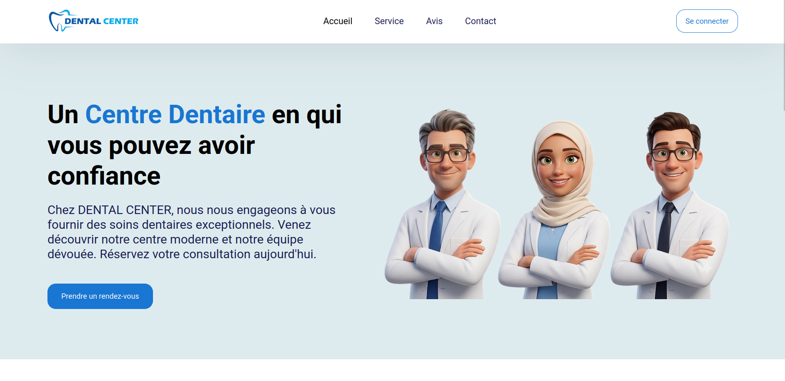
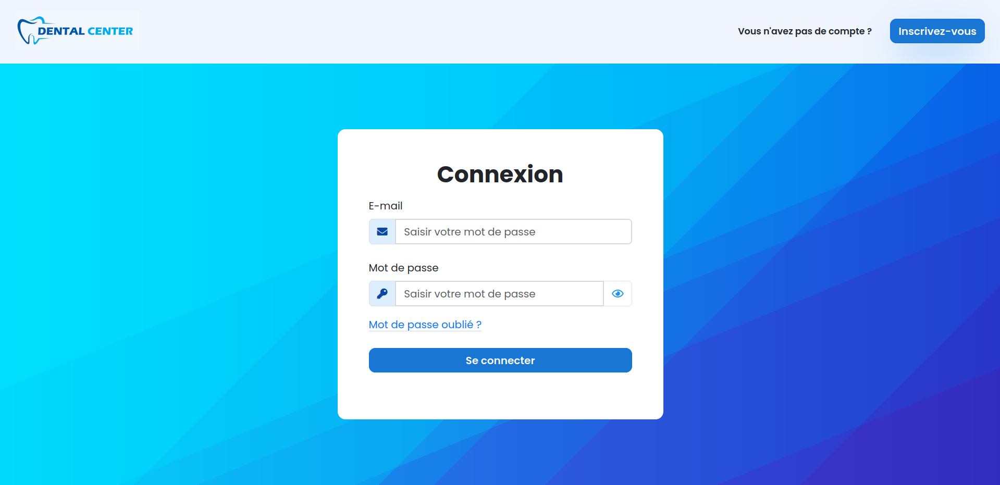
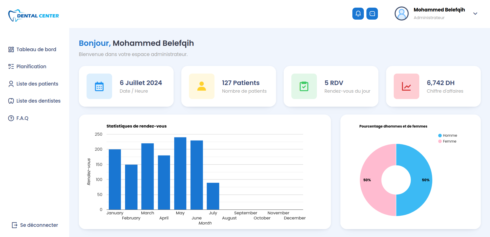
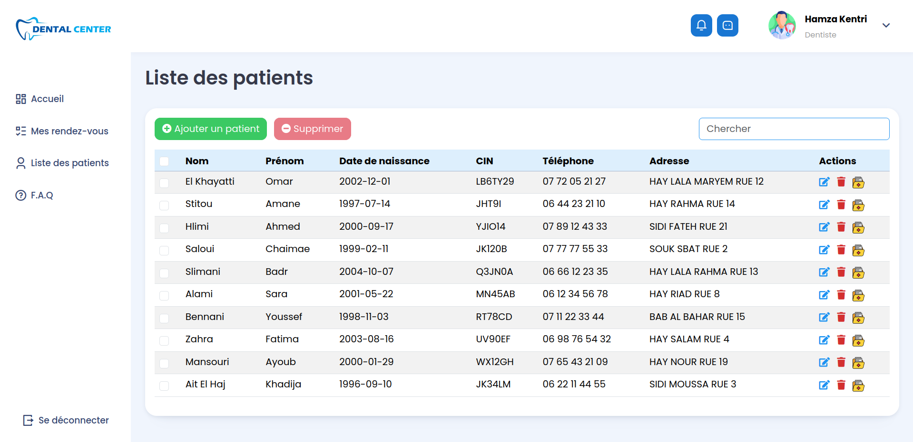
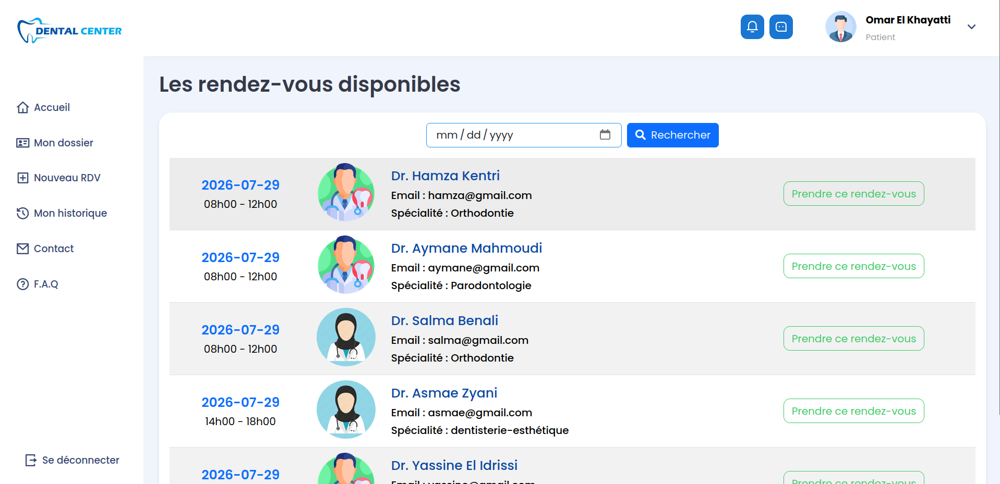
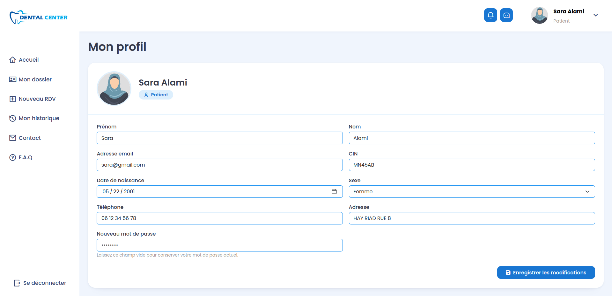
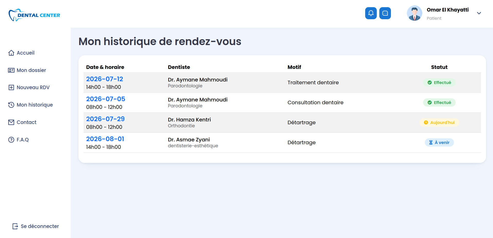
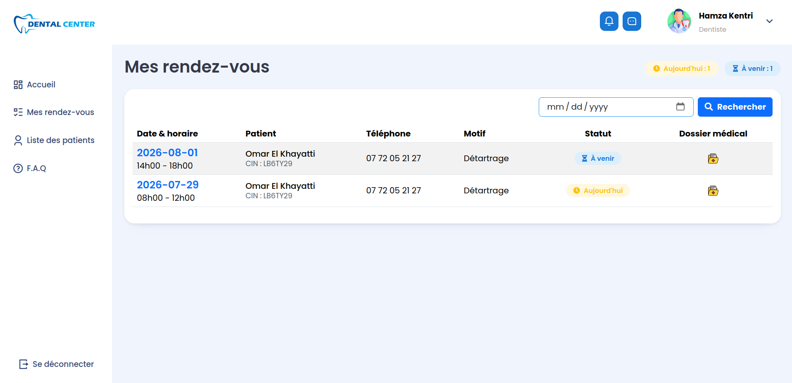
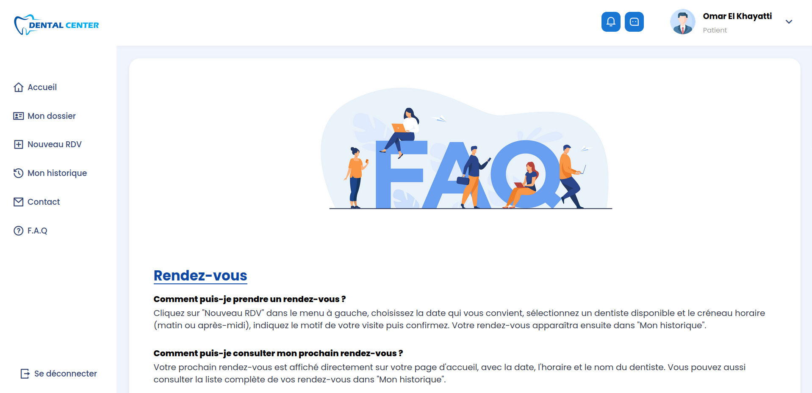
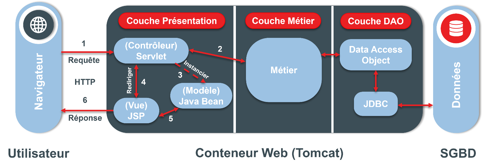

# ***Application Web JEE pour un Centre de Chirurgie Dentaire***

Application web full-stack pour la gestion d'un centre de chirurgie dentaire (patients, dentistes, rendez-vous, dossiers médicaux), avec un backend Java EE sécurisé et une interface responsive.

---

## 🛠️ Outils utilisés

**Backend**<br>


**Frontend**<br>


**Base de données**<br>


**Conception & maquettage**<br>


**Environnement de développement**<br>


**Autres**<br>


---

## 🔧 Fonctionnalités principales

- 🔐 Authentification et inscription sécurisée avec vérification par code OTP envoyé par email
- 👥 Trois espaces dédiés : Administrateur, Dentiste et Patient
- 🧑‍⚕️ Gestion des patients et des dentistes (ajout, modification, suppression)
- 📅 Planification et prise de rendez-vous en ligne
- 🩺 Dossier médical par patient, avec ses rendez-vous
- 👤 Consultation du profil utilisateur
- 📊 Tableaux de bord avec statistiques
- ❓ FAQ dédiée à chaque type d'utilisateur

---

## 🖼️ Interfaces de l'application

<table>
  <tr>
    <td align="center"><br/><b>Accueil</b></td>
    <td align="center"><br/><b>Connexion</b></td>
  </tr>
  <tr>
    <td align="center"><br/><b>Tableau de bord (Admin)</b></td>
    <td align="center"><br/><b>Liste des patients</b></td>
  </tr>
  <tr>
    <td align="center"><br/><b>Prise de rendez-vous</b></td>
    <td align="center"><br/><b>Dossier médical du patient</b></td>
  </tr>
  <tr>
    <td align="center"><br/><b>Profil utilisateur</b></td>
    <td align="center"><br/><b>Historique de rendez-vous</b></td>
  </tr>
  <tr>
    <td align="center"><br/><b>Rendez-vous de dentiste</b></td>
    <td align="center"><br/><b>FAQ</b></td>
</table>


---

## 🏗️ Architecture MVC



L'application est structurée en trois couches, avec séparation stricte des responsabilités :

- **Couche Présentation** : Servlets (contrôleurs) et JSP (vues), point d'entrée des requêtes utilisateur.
- **Couche Métier** : logique applicative de l'application, appelée par les Servlets.
- **Couche DAO** : accès aux données via JDBC, exécution des opérations CRUD sur la base MySQL.

---

## 🚀 Utilisation du projet

Deux façons de lancer le projet, au choix.

### Option 1 — ☕ Manuellement

**Prérequis :**

- [Java JDK 17](https://adoptium.net/)
- [Eclipse IDE for Enterprise Java Developers](https://www.eclipse.org/downloads/packages/release/kepler/sr2/eclipse-ide-java-ee-developers)
- [Apache Tomcat 9](https://tomcat.apache.org/download-90.cgi)
- [MySQL 8](https://dev.mysql.com/downloads/mysql/)
- [Git](https://git-scm.com/)

**Étapes :**

1. Cloner le projet :
   ```bash
   git clone https://github.com/m-belefqih/dental-center-app.git
   cd dental-center-app
   ```

2. Créer une base de données MySQL nommée `dental_center_db`, puis importer son schéma à partir du fichier [dental_center_db.sql](dental_center_db.sql) situé à la racine du projet.

3. Créer le fichier de configuration : dans `src/main/resources`, copier le fichier `application.properties.example` vers un nouveau fichier `application.properties`, puis y renseigner vos identifiants MySQL et un [mot de passe d'application Gmail](https://support.google.com/accounts/answer/185833) pour l'envoi des codes OTP.

4. Importer le projet dans Eclipse (`File > Import > Existing Maven Projects`), ajouter un serveur Tomcat 9 dans l'onglet **Servers** (clic droit > New > Server), puis démarrer le projet sur ce serveur (`Run As > Run on Server`).

5. Accéder à l'application via `http://localhost:8080/dental-center-app/`.

### Option 2 — 🐳 Avec Docker et Docker Compose

**Prérequis :**

- [Docker](https://docs.docker.com/get-docker/)
- [Docker Compose](https://docs.docker.com/compose/install/)

**Étapes :**

1. Cloner le projet :
   ```bash
   git clone https://github.com/m-belefqih/dental-center-app.git
   cd dental-center-app
   ```

2. Créer le fichier `.env` à partir du modèle et le compléter (mot de passe MySQL, identifiants Gmail pour l'envoi des codes OTP) :
   ```bash
   cp .env.example .env
   ```

3. Construire les images et démarrer les conteneurs :
   ```bash
   docker compose up --build
   ```

4. Accéder à l'application : [http://localhost:8080/dental-center-app/](http://localhost:8080/dental-center-app/)

5. Pour arrêter l'application :
   ```bash
   docker compose down
   ```

---

## 🎓 Contexte académique

Ce projet a été réalisé dans le cadre du Projet de Fin d'Études (PFE), en vue de l'obtention du Diplôme de Licence Fondamentale en Sciences Mathématiques et Informatiques (LF-SMI).

**Réalisé par :** Mohammed Belefqih 
**Supervisé par :** Pr. Zyad Elkhadir

Le travail a couvert la **conception**, le **maquettage** et le **développement** de l'application.
